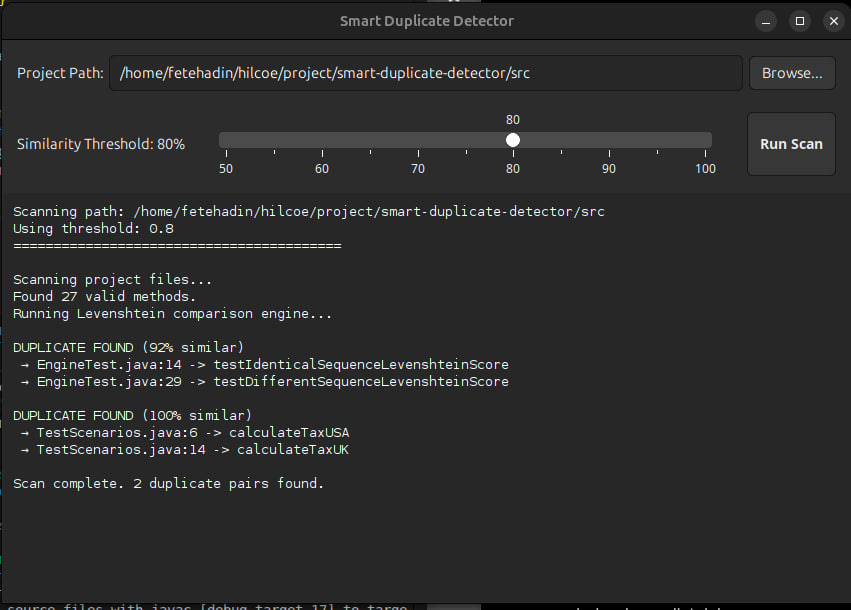

# Smart Duplicate Detector



## Overview

A Java tool that scans a codebase and flags methods with duplicate or highly similar logic before they become technical debt.

Developers often reuse or regenerate business logic without realizing an equivalent method already exists elsewhere in the codebase. Over time these duplicates drift apart, and bugs get fixed in one copy but not the other. Smart Duplicate Detector scans a project, compares every method, and reports matches above a similarity threshold—with file, line number, and score—so duplication is caught before it's merged.

---

## The "Why": Technical Approach

Traditional duplicate detectors often rely on raw string matching or tokenization. This leads to a massive amount of "false positive" noise—flagging standard boilerplate, imports, or basic getters and setters as duplicated code.

**Smart Duplicate Detector** solves this using a two-step semantic approach:

1. **AST Method Parsing:** By leveraging JavaParser, the engine parses the codebase into an Abstract Syntax Tree (AST) and isolates functional methods. It completely ignores class-level boilerplate, fields, and imports.

2. **Weighted Levenshtein Algorithm:** Instead of basic string comparison, SDD compares the logic and structure of the methods using a custom Weighted Levenshtein distance algorithm. This accurately calculates similarity percentages, ensuring that only genuine logic clones are flagged while ignoring minor whitespace or variable renaming differences.

---

## Features

- Recursive scan of a Java project for `.java` files.
- Structural extraction of every method into a comparable AST model.
- Highly accurate similarity scoring via `LevenshteinSimilarity`.
- **Standalone Desktop App:** Native-looking Java Swing GUI with real-time background scanning (`SwingWorker`) and dynamic threshold adjustment.
- **Command-line (CLI):** Headless entry point sharing the exact same detection engine.
- Custom exception handling for invalid or empty project paths.
- *(Planned)* Scan a public GitHub repository directly by URL instead of a local path.

---

## Tech Stack

| Layer | Technology |
| :--- | :--- |
| **Language** | Java 17 |
| **Build** | Maven |
| **Parsing** | JavaParser |
| **Desktop GUI** | Java Swing |
| **Backend / API** | Javalin (REST, JSON via Jackson) |
| **Testing** | JUnit 5 |

---

## Architecture

```text
smart-duplicate-detector/
├── model/        MethodModel, DuplicatePair
├── core/         ProjectScanner, AstMethodParser, SimilarityAlgorithm, LevenshteinSimilarity, DuplicateDetector
├── gui/          MainFrame (Swing Desktop App)
├── report/       AbstractReport, ConsoleReport
├── exceptions/   InvalidProjectPathException, NoJavaFilesFoundException
├── api/          ApiServer (REST endpoints)
├── cli/          CliRunner
└── resources/    (web frontend / static files)
```

---

## Getting Started

### Prerequisites

- Java 17+
- Maven 3.8+

### Clone the Repository

```bash
git clone https://github.com/fetehadin/smart-duplicate-detector.git
cd smart-duplicate-detector
mvn clean package
```

---

## Run — Desktop GUI (Default Fat-JAR)

```bash
java -jar target/smart-duplicate-detector.jar
```

The GUI will launch automatically. Select your project directory, adjust the similarity threshold slider, and click **Scan**.

---

## Run — CLI

```bash
java -cp target/smart-duplicate-detector.jar com.yourteam.sdd.cli.CliRunner --path ./path/to/project --threshold 0.80
```

---

## Usage Example (CLI & GUI Output)

```text
Scanning project files...
Found 27 valid methods.
Running Levenshtein comparison engine...

DUPLICATE FOUND (92% similar)
 → EngineTest.java:14 -> testIdenticalSequenceLevenshteinScore
 → EngineTest.java:29 -> testDifferentSequenceLevenshteinScore

DUPLICATE FOUND (100% similar)
 → TestScenarios.java:6 -> calculateTaxUSA
 → TestScenarios.java:14 -> calculateTaxUK

Scan complete. 2 duplicate pairs found.
```

---

## Known Limitations

- Comparison is all-pairs (`O(n²)`)—fine for a single project, not intended for large monorepos.
- Only structural/token similarity is considered—no control-flow or semantic analysis.
- Currently scans a path accessible to the machine running the application; GitHub-repo scanning (clone + scan by URL) is planned.

---

## License

MIT — see `LICENSE`.