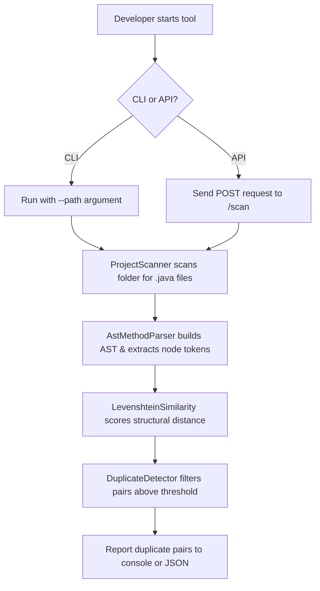
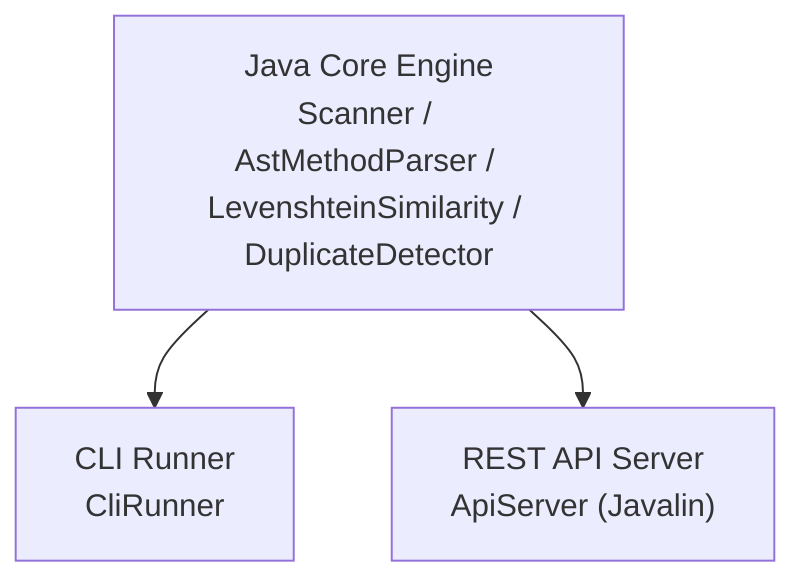
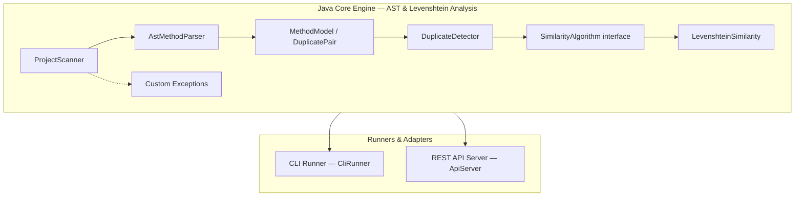

# Smart Duplicate Detector — Master Project Document

**Course:** Object-Oriented Programming with Java

**Status:** Instructor-approved / Implementation Complete

**Document type:** Single source of truth — SRS, Architecture Guide, Development Roadmap, and Team Handbook combined

> **How to use this document:** Section 19 (Scope Definition) is the most important section in this entire document. When in doubt about whether something belongs in the graded submission, that section is the answer, not this note.

---

## Table of Contents

1. [Project Overview](https://www.google.com/search?q=%231-project-overview)
2. [Problem Analysis](https://www.google.com/search?q=%232-problem-analysis)
3. [Project Goals](https://www.google.com/search?q=%233-project-goals)
4. [Features](https://www.google.com/search?q=%234-features)
5. [User Workflow](https://www.google.com/search?q=%235-user-workflow)
6. [System Architecture](https://www.google.com/search?q=%236-system-architecture)
7. [OOP Design](https://www.google.com/search?q=%237-oop-design)
8. [Technology Stack](https://www.google.com/search?q=%238-technology-stack)
9. [Project Folder Structure](https://www.google.com/search?q=%239-project-folder-structure)
10. [Development Phases](https://www.google.com/search?q=%2310-development-phases)
11. [Sprint Planning](https://www.google.com/search?q=%2311-sprint-planning)
12. [Implementation Guide](https://www.google.com/search?q=%2312-implementation-guide)
13. [Coding Standards](https://www.google.com/search?q=%2313-coding-standards)
14. [Git Workflow](https://www.google.com/search?q=%2314-git-workflow)
15. [Team Responsibilities](https://www.google.com/search?q=%2315-team-responsibilities)
16. [Testing Strategy](https://www.google.com/search?q=%2316-testing-strategy)
17. [Risks](https://www.google.com/search?q=%2317-risks)
18. [Future Improvements](https://www.google.com/search?q=%2318-future-improvements)
19. [Scope Definition](https://www.google.com/search?q=%2319-scope-definition)
20. [Deliverables](https://www.google.com/search?q=%2320-deliverables)
21. [Final Architecture Diagram](https://www.google.com/search?q=%2321-final-architecture-diagram)
22. [Appendix](https://www.google.com/search?q=%2322-appendix)

---

## 1. Project Overview

* **Project name:** Smart Duplicate Detector
* **Vision:** A Java codebase where duplicate logic is caught before it's merged, not discovered months later as a bug that was fixed in one copy and forgotten in another.
* **Mission:** Build a tool, fully understood and fully owned by the team, that scans a Java project, parses methods using Abstract Syntax Trees (JavaParser), scores how structurally similar each method is to every other method using Levenshtein distance, and gives the developer a way to act on what it finds — not just a report to read.
* **Problem statement:** Developers frequently reuse or regenerate business logic — manually or through AI coding assistants — without realizing an equivalent method already exists elsewhere in the codebase. Over time these duplicates drift apart: a bug gets fixed in one copy, not the other.
* **Target users:** Java developers and code reviewers checking a pull request before merge.
* **Expected outcome:** A working, fully-explainable Java application (command line, REST API server, and unit/integration test suites) that detects duplicate methods with a precise percentage similarity score based on AST structural nodes.

---

## 2. Problem Analysis

### What developers currently face

Code duplication increases maintenance cost because a change to shared logic must be made in every copy, and if a copy is missed, the two versions silently drift apart. This is a long-documented category of technical debt, and it is getting worse: rising use of AI coding assistants is measurably increasing how much duplicate code enters real projects, because generating new code is now faster than searching for and reusing existing code.

### How this project solves the gap

Smart Duplicate Detector builds an Abstract Syntax Tree (AST) of every Java file using JavaParser, walks the internal node structure (extracting exact sequences of node types like `IfStmt`, `ForStmt`, `ReturnStmt`), and compares them using a Levenshtein edit distance matrix. This ensures that renamed variables, reformatted whitespace, or altered literal values do not trick the engine—it evaluates pure logic structures.

---

## 3. Project Goals

### Primary goals (Phase 1–4)

* Recursively scan project directories and parse Java files using JavaParser (`AstMethodParser`).
* Score method similarity structurally via Levenshtein Distance (`LevenshteinSimilarity`).
* Provide both a command-line interface (`CliRunner`) and a REST backend (`ApiServer`).
* Demonstrate core OOP principles (Encapsulation, Polymorphism, Abstraction, Inheritance).
* Handle invalid input gracefully via custom checked exceptions (`InvalidProjectPathException`, `NoJavaFilesFoundException`).
* Maintain a robust unit and integration test suite (`EngineTest`, `IntegrationTest`).

### Secondary & Future goals

* Swing desktop GUI enhancements.
* A documentation + live-demo website.
* A VS Code extension with an interactive review workflow.

---

## 4. Features

* **F1 — Project Scanner:** Recursively finds every `.java` file under a given folder (`ProjectScanner`).
* **F2 — AST Method Parser:** Parses each file via JavaParser and extracts method declarations into structured AST token lists (`AstMethodParser`).
* **F3 — Levenshtein Structural Scorer:** Evaluates the sequence of AST node types using a dynamic programming edit-distance matrix to produce an accurate similarity percentage (`LevenshteinSimilarity`).
* **F4 — Duplicate Detector:** Compares method pairs while filtering out self-comparisons and duplicate reverse pairs against a dynamic threshold (`DuplicateDetector`).
* **F5 — Reporting:** Formats and prints the list of duplicate pairs to the console or renders them via JSON endpoints.
* **F6 — Error Handling:** Raises specific, self-defined checked exceptions for invalid or empty project paths instead of crashing.

---

## 5. User Workflow



---

## 6. System Architecture

### High-level architecture



*Note: Every box outside the Core Engine is a thin adapter. None of them contain detection or scoring logic — that lives in the core engine.*

---

## 7. OOP Design

* **Encapsulation:** `MethodModel` and `DuplicatePair` expose their data only through getters; fields are private and set once through the constructor.
* **Abstraction:** `SimilarityAlgorithm` is an interface with a single method, `compare(MethodModel a, MethodModel b): double`. `DuplicateDetector` depends only on this interface, never on a specific scoring implementation.
* **Inheritance:** `AbstractReport` holds report logic shared by every output format; `ConsoleReport` extends it and supplies only the console-specific formatting.
* **Polymorphism:** `DuplicateDetector` calls `similarityAlgorithm.compare(...)` through the interface reference. At runtime, this resolves to `LevenshteinSimilarity`.
* **Custom Exceptions:** Extend standard checked exceptions (`Exception`), forcing callers to handle anticipated input errors explicitly.

---

## 8. Technology Stack

| Layer | Technology | Why chosen |
| --- | --- | --- |
| **Language** | Java 17 | Course requirement; modern long-term-support release |
| **Build tool** | Maven | Standard, widely documented, simple dependency management |
| **AST Parser** | JavaParser Core (`3.25.4`) | Robust library for traversing Java Abstract Syntax Trees |
| **REST layer** | Javalin | Minimal, unopinionated request handler framework |
| **Testing** | JUnit 5 | Standard Java testing framework supporting `@TempDir` |
| **Version control** | Git & GitHub | Team collaboration, branching, PR review |

---

## 9. Project Folder Structure

```text
smart-duplicate-detector/
├── pom.xml
├── README.md
├── docs/
│   └── MASTER_PROJECT_DOCUMENT.md
└── src/
    ├── main/java/com/yourteam/sdd/
    │   ├── api/
    │   │   └── ApiServer.java
    │   ├── cli/
    │   │   └── CliRunner.java
    │   ├── core/
    │   │   ├── AstMethodParser.java
    │   │   ├── DuplicateDetector.java
    │   │   ├── LevenshteinSimilarity.java
    │   │   ├── ProjectScanner.java
    │   │   └── SimilarityAlgorithm.java
    │   ├── exceptions/
    │   │   ├── InvalidProjectPathException.java
    │   │   └── NoJavaFilesFoundException.java
    │   ├── model/
    │   │   ├── DuplicatePair.java
    │   │   └── MethodModel.java
    │   └── report/
    │       └── ConsoleReport.java
    └── test/java/com/yourteam/sdd/
        └── core/
            ├── EngineTest.java
            └── IntegrationTest.java

```

---

## 10. Development Phases

* **Phase 1 — Core Engine Setup & AST Integration:** Created Maven configuration, custom exceptions, `MethodModel`, `DuplicatePair`, `ProjectScanner`, and `AstMethodParser` utilizing JavaParser.
* **Phase 2 — Detection Logic & Scoring:** Implemented `SimilarityAlgorithm`, `LevenshteinSimilarity`, and `DuplicateDetector` to evaluate AST token sequences via dynamic programming.
* **Phase 3 — Runners & API Integration:** Built the CLI runner (`CliRunner`) and Javalin REST API server (`ApiServer`) adapter layers.
* **Phase 4 — Testing Suite & Polish:** Implemented comprehensive unit (`EngineTest`) and integration (`IntegrationTest`) test suites using JUnit 5, achieving complete build verification (`BUILD SUCCESS`).

---

## 11. Sprint Planning

| Sprint | Objectives | Tasks | Expected Output | Definition of Done |
| --- | --- | --- | --- | --- |
| **Sprint 1** | Core data model + AST scanning | Phase 1 tasks | Scanner and JavaParser extract method node sequences | Code compiled, unit tested |
| **Sprint 2** | Detection logic & scoring | Phase 2 tasks | Levenshtein similarity scorer and duplicate detection engine | Runs end-to-end on test code |
| **Sprint 3** | Runners & API integration | Phase 3 tasks | CLI runner and Javalin API endpoints functional | Executable adapters call core engine successfully |
| **Sprint 4** | Testing & docs | Phase 4 tasks | JUnit 5 unit and integration test suite | All tests pass cleanly (`mvn test`) |

---

## 12. Implementation Guide

1. **Project Setup:** Initialize Maven `pom.xml` with Java 17 and `javaparser-core`.
2. **Models & Exceptions:** Build immutable `MethodModel` and `DuplicatePair` classes alongside custom checked exceptions.
3. **Core Engine:** Implement `ProjectScanner` for recursive file traversal and `AstMethodParser` for node-type extraction.
4. **Similarity & Detection:** Implement `SimilarityAlgorithm`, `LevenshteinSimilarity`, and `DuplicateDetector`.
5. **Adapters & Runners:** Implement `CliRunner` and `ApiServer`.
6. **Testing Suite:** Add isolated unit tests (`EngineTest`) and end-to-end temporary directory integration tests (`IntegrationTest`).

---

## 13. Coding Standards

* **Classes:** `PascalCase` (e.g., `LevenshteinSimilarity`)
* **Methods/Variables:** `camelCase` (e.g., `findDuplicates`)
* **Constants:** `UPPER_SNAKE_CASE` (e.g., `DEFAULT_THRESHOLD`)
* **Packages:** Lowercase hierarchical domain naming (`com.yourteam.sdd.core`)

---

## 14. Git Workflow

* **Branches:** `main` (protected) → `dev` (integration) → `feature/` (individual tasks)
* **Commit Messages:** Descriptive statements indicating *what changed*.
* **Pull Requests:** Require code review and approval before merging into `dev`.

---

## 15. Team Responsibilities

* **Architecture Lead:** Owns core structure and structural consistency (`com.yourteam.sdd.core`).
* **Backend/Engine Developer:** Implements scanning, AST parsing, and detection pipelines.
* **API/Adapter Developer:** Maintains CLI and Javalin endpoints.
* **Documentation Lead:** Keeps SRS and Master Document synchronized with actual source code.

---

## 16. Testing Strategy

* **Unit Testing (`EngineTest.java`):** Validates isolated components like Levenshtein score matching for identical/different sequences and threshold filtering.
* **Integration Testing (`IntegrationTest.java`):** Creates temporary test environments (`@TempDir`) containing real `.java` files to execute the full scanner-parser-detector pipeline end-to-end.
* **Execution:** Run via `mvn test`.

---

## 17. Risks

* **False positives in similarity scoring:** Mitigated by configuring adjustable thresholds and testing against known AST structures.
* **AST parsing syntax overhead:** Managed by utilizing mature JavaParser libraries and handling file-reading exceptions gracefully.

---

## 18. Future Improvements

* Keep/Replace decision workflow using the Command pattern.
* Additional report formats (JSON, HTML) extending `AbstractReport`.
* Full IDE and editor integrations.

---

## 19. Scope Definition

### IN SCOPE (Graded Submission)

* Recursive Java project directory scanning.
* JavaParser AST traversal and structural token normalization.
* Levenshtein similarity metric calculation.
* CLI execution and REST API server capabilities.
* Full JUnit 5 unit and integration test coverage (`BUILD SUCCESS`).

### FUTURE SCOPE

* Interactive GUI enhancements, VS Code extensions, and third-party language adapters.

---

## 20. Deliverables

* A fully compiling Maven project (`mvn clean compile`).
* A passing test suite (`mvn test`).
* Runnable CLI and API server configurations.
* Comprehensive documentation (`MASTER_PROJECT_DOCUMENT.md`).

---

## 21. Final Architecture Diagram



---

## 22. Appendix

### Glossary

* **AST (Abstract Syntax Tree):** A tree representation of the abstract syntactic structure of source code written in a programming language.
* **Structural Token:** The node type classification (e.g., `IfStmt`, `ForStmt`, `ReturnStmt`) extracted from a method's AST body.
* **Levenshtein Distance:** The minimum number of single-character edits required to change one word into the other, applied here to sequences of structural node types.
* **Threshold:** The minimum similarity score required for a method pair to be reported as a duplicate.

### Resources & Links

* JUnit 5 documentation — [https://junit.org/junit5/docs/current/user-guide/](https://junit.org/junit5/docs/current/user-guide/)
* JavaParser documentation — [https://javaparser.org/](https://www.google.com/search?q=https://javaparser.org/)
* Project repository: [https://github.com/fetehadin/smart-duplicate-detector](https://github.com/fetehadin/smart-duplicate-detector)